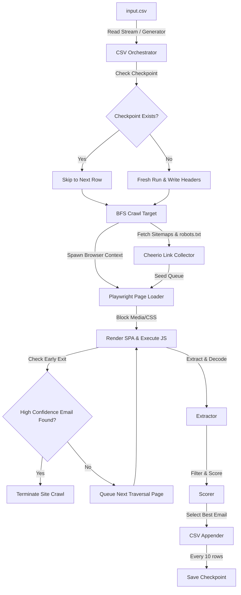

# mailpop 🎯

mailpop is a production-ready, highly optimized TypeScript application built on top of **Node.js 22+** and **Playwright Chromium** to discover reliable, public contact emails directly from company websites.

Designed specifically for cold outreach lead enrichment where sender reputation is critical, mailpop implements robust verification heuristics, email score priorities, and strict validation checks. It **never invents or guesses emails**; it only returns emails found explicitly on the public web.

---

## Key Features

- 🌐 **SPA & Javascript Execution**: Uses Playwright Chromium (headless by default) to handle modern frameworks (React, Next.js, Vue, Angular, Astro, etc.) and redirects.
- ⚡ **BFS Crawler with Priority Routing**: Custom Breadth-First-Search (BFS) traversal prioritizing contact-relevant paths (`contact`, `about`, `support`, etc.) up to depth 2.
- 📂 **Sitemap & Robots.txt Parser**: Scans `robots.txt` and recursively crawls sitemaps (and sitemap indices) using Cheerio in `xmlMode` to extract links before crawling.
- 🔐 **Obfuscation Decoders**: Automatically bypasses and decodes Cloudflare email protection, HTML entities, Unicode sequences, Base64 strings, and common textual patterns (e.g., `name [at] company [dot] com`).
- 📊 **Scoring & Confidence Engines**: Computes a confidence score based on the location of the email (footer, header, body, mailto, script), page relevance, domain-match alignment, and frequency.
- 💾 **Memory Efficient Streaming**: Reads input CSVs and appends output CSV records incrementally using Node.js async generators and `fast-csv`. Handles datasets of 100 to 50,000+ entries without memory leaks.
- 🔄 **Contiguous Checkpoints & Resuming**: Automatically saves crawler checkpoints every 10 rows. If the process is killed (SIGINT/SIGTERM or crash), it resumes exactly from the last processed contiguous row.
- 🚦 **Adaptive Throttling**: Adds randomized throttling delays between page requests of the same website to respect rate limits and prevent server hammer.
- 📝 **Structured Logging**: Generates JSON-formatted app logs, error logs, and dedicated email discovery logs in the `logs/` directory.

---

## Architecture Overview



---

## Tech Stack

- **Runtime**: Node.js 22+ (ES Modules)
- **Language**: TypeScript 5+ (Strict mode compiler settings)
- **Scraping**: Playwright Chromium, Cheerio
- **Data & Streams**: Fast CSV, p-limit
- **Tooling**: tsx (Development runner), ESLint 9+ (Flat config), Prettier

---

## Configuration (`.env`)

Create a `.env` file in the root directory (based on `.env.example`):

```env
# Input & Output Files
INPUT_CSV=input.csv
OUTPUT_CSV=output/output.csv
CHECKPOINT_FILE=output/checkpoint.json
CACHE_DIR=output/cache

# Crawling Limits
CONCURRENCY=5
MAX_DEPTH=2
MAX_PAGES_PER_SITE=25
MAX_CRAWL_TIME_PER_SITE_MS=60000
PAGE_TIMEOUT_MS=15000

# Browser Settings
HEADLESS=true

# Throttling & Delay
MIN_DELAY_MS=500
MAX_DELAY_MS=2000

# Retry Configuration
MAX_RETRIES=3
RETRY_INITIAL_DELAY_MS=1000
RETRY_MAX_DELAY_MS=10000
```

---

## Installation & Setup

1. **Navigate to the project directory**:
   ```bash
   cd mailpop
   ```

2. **Install Node dependencies**:
   ```bash
   npm install
   ```

3. **Install Playwright Browsers**:
   ```bash
   npx playwright install chromium
   ```

4. **Prepare the configuration**:
   ```bash
   cp .env.example .env
   ```

5. **Prepare your input data**:
   Put your company websites list in `input.csv` (see `input.csv` for the template).

---

## CLI & npx Execution

After compiling the codebase with `npm run build`, you can invoke the program directly as a CLI tool using `npx`.

### Command Syntax

```bash
# General invocation (defaults to config settings for input and output)
npx .

# Custom input and output paths (positional arguments)
npx . my_leads.csv enriched_output.csv

# Using explicit flags
npx . -i my_leads.csv -o enriched_output.csv

# Viewing CLI help options
npx . -h
```

### Available Package Scripts

| Script | Command | Description |
| :--- | :--- | :--- |
| `npm run dev` | `tsx src/index.ts` | Runs the development code directly using `tsx` |
| `npm run build` | `tsc` | Compiles the TypeScript code to standard ES Modules in `dist/` |
| `npm run start` | `node dist/index.js` | Runs the compiled output binary |
| `npm run lint` | `eslint src` | Checks code against linting rules |
| `npm run format` | `prettier --write "src/**/*.ts"` | Formats code using Prettier |
| `npm run typecheck` | `tsc --noEmit` | Performs static type checks |

---

## CSV Data Processing Heuristics

### Dynamic Header Matching

mailpop does not mandate a fixed schema. It accepts CSVs with **any custom columns** (e.g. CRM IDs, Industry, Contact Names). 

The crawler dynamically detects the target domain or website by scanning row headers case-insensitively for keywords: `website`, `url`, `domain`, `site`, or `web` (supporting partial matches like `CompanyDomain` or `target_url`).

### Enriched Output Generation

When writing the output, mailpop **preserves 100% of the original columns** and appends the enrichment results as new columns:

- `email`: The discovered, verified contact email (leaves empty if none is confidently found).
- `email_source`: Specific URL/page where the email was located.
- `email_type`: Classifies the email category (`role`, `personal`, `automated`).
- `confidence_score`: Confidence score rating from 10 to 100.
- `discovery_method`: Scraping discovery origin (`contact-page`, `about-page`, `footer`, `header`, `sitemap`, `general-page`, `obscure-js`, `mailto-link`).

#### Custom Column Matching Example

**Input CSV (`custom_leads.csv`)**:
```csv
CompanyID,CompanyDomain,Industry,ContactPerson
1001,https://github.com,Technology,John Doe
```

**Output CSV (`enriched.csv`)**:
```csv
CompanyID,CompanyDomain,Industry,ContactPerson,email,email_source,email_type,confidence_score,discovery_method
1001,https://github.com,Technology,John Doe,copyright@github.com,https://docs.github.com/site-policy/github-terms/github-terms-of-service,personal,100,mailto-link
```

---

## Structured Log Output (`logs/`)

- `logs/app.log`: General JSON logs showing crawl transitions and app events.
- `logs/errors.log`: Failures, timeouts, or exceptions raised by page crawls.
- `logs/discovered-emails.log`: Every email address found during the traversal, containing its source and confidence metrics.

Example log entry in `discovered-emails.log`:
```json
{"timestamp":"2026-06-03T09:12:00.123Z","domain":"acme.com","email":"contact@acme.com","emailSource":"https://acme.com/contact","confidenceScore":98,"discoveryMethod":"contact-page"}
```
